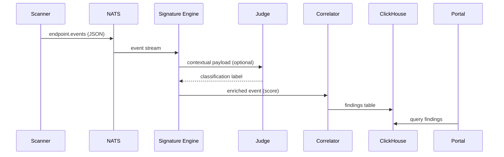

# MCPeeker — Technical Specification v1.0

---

## 1 · Overview

**Objective:**
Define the data contracts, APIs, message flows, and component interfaces for the MCPeeker system — an enterprise-grade platform for detecting, correlating, and visualizing Model Context Protocol (MCP) activity.

**Primary Interfaces:**

* Event schemas (`endpoint.events`, `network.events`, `gateway.events`)
* Service APIs (Registry, Findings, Config)
* Component boundaries (Scanner ↔ Signature Engine ↔ Correlator ↔ UI)
* Data storage schemas (ClickHouse + Postgres)
* Config YAML specifications

---

## 2 · System Components

| Component            | Language                                           | Responsibility                                 |
| -------------------- | -------------------------------------------------- | ---------------------------------------------- |
| **Go Scanner**       | Go                                                 | Local detection: MCP configs, processes, ports |
| **Signature Engine** | Go/Python                                          | Apply Knostik patterns to incoming events      |
| **Correlator**       | Go                                                 | Merge events and compute scores                |
| **Judge Service**    | Python                                             | LLM-based semantic classification              |
| **Registry API**     | FastAPI (Python)                                   | Authorized MCP database and RBAC               |
| **Portal UI**        | React + Tailwind                                   | Visualization and workflows                    |
| **Storage**          | ClickHouse (analytics), PostgreSQL (registry/meta) |                                                |
| **Message Bus**      | NATS JetStream                                     | Event transport with at-least-once guarantees  |

---

## 3 · Event Flow



---

## 4 · Message Schemas

### 4.1 `endpoint.events`

```json
{
  "event_type": "endpoint.events",
  "version": "1.0",
  "host_id": "uuid-v4",
  "timestamp": "2025-10-16T12:00:00Z",
  "os": "macOS",
  "scanner_version": "0.2.0",
  "evidence": [
    {
      "type": "file",
      "path": "/Users/alice/.vscode/mcp.json",
      "sha256": "b7d9f...",
      "snippet": "{\"protocolVersion\":",
      "score": 5
    },
    {
      "type": "process",
      "pid": 3245,
      "cmd": "python -m mcp_server --manifest manifest.json",
      "score": 6
    }
  ],
  "local_score": 11
}
```

### 4.2 `network.events` (Zeek/Suricata)

```json
{
  "event_type": "network.events",
  "version": "1.0",
  "src_ip": "10.1.3.44",
  "dst_ip": "52.11.22.33",
  "dst_port": 8080,
  "protocol": "http",
  "indicators": ["jsonrpc 2.0", "text/event-stream"],
  "payload_excerpt": "{\"method\":\"tools/list\"}",
  "score": 3,
  "sensor_id": "zeek-edge01"
}
```

### 4.3 `gateway.events`

```json
{
  "event_type": "gateway.events",
  "version": "1.0",
  "src_user": "user123",
  "model_id": "claude-3-sonnet",
  "request_excerpt": "initialize capabilities tools...",
  "response_code": 200,
  "metadata": {
    "tenant_id": "finance-ml",
    "client_app": "internal-llm-gateway"
  }
}
```

---

## 5 · Inter-Service APIs

### 5.1 Registry API

| Method   | Path                  | Description                             |
| -------- | --------------------- | --------------------------------------- |
| `POST`   | `/api/v1/mcps`        | Create or update a registered MCP entry |
| `GET`    | `/api/v1/mcps`        | List MCP entries                        |
| `GET`    | `/api/v1/mcps/{id}`   | Retrieve MCP record                     |
| `DELETE` | `/api/v1/mcps/{id}`   | Remove MCP entry                        |
| `POST`   | `/api/v1/mcps/verify` | Verify MCP by host/port combination     |
| `POST`   | `/api/v1/feedback`    | Submit manual review feedback           |

#### Create MCP Example

```json
POST /api/v1/mcps
{
  "host": "10.1.2.3",
  "port": 8080,
  "owner": "alice@corp",
  "team": "nlp",
  "purpose": "test MCP for RAG",
  "expires_at": "2026-01-01T00:00:00Z"
}
```

---

### 5.2 Findings API

| Method  | Path                    | Description                   |
| ------- | ----------------------- | ----------------------------- |
| `GET`   | `/api/v1/findings`      | Paginated list of detections  |
| `GET`   | `/api/v1/findings/{id}` | Full evidence view            |
| `PATCH` | `/api/v1/findings/{id}` | Update classification (FP/TP) |

#### Finding Schema

```json
{
  "id": "uuid",
  "correlated_score": 12,
  "classification": "unauthorized",
  "judge_label": "Likely_MCP",
  "registry_match": false,
  "signals": {
    "endpoint": 11,
    "network": 3,
    "judge": 5
  },
  "created_at": "2025-10-16T12:00:00Z"
}
```

---

## 6 · ClickHouse Schema

```sql
CREATE TABLE findings (
  id UUID,
  host_id String,
  correlated_score Int8,
  classification LowCardinality(String),
  registry_match Bool,
  judge_label String,
  signals Nested(
    name String,
    score Int8
  ),
  timestamp DateTime,
  evidence JSON,
  INDEX score_idx correlated_score TYPE minmax GRANULARITY 1
) ENGINE = MergeTree()
ORDER BY (timestamp, host_id);
```

---

## 7 · Registry (PostgreSQL)

```sql
CREATE TABLE mcps (
  id UUID PRIMARY KEY,
  host VARCHAR(255),
  port INT,
  owner VARCHAR(255),
  team VARCHAR(255),
  purpose TEXT,
  expires_at TIMESTAMP,
  approved BOOLEAN DEFAULT false,
  created_at TIMESTAMP DEFAULT now(),
  updated_at TIMESTAMP DEFAULT now()
);
```

---

## 8 · YAML Config Specification

### global.yaml

```yaml
service:
  name: mcpeeker
  version: 0.2.0
security:
  mtls: true
  ca_cert: /etc/mcpeeker/ca.pem
broker:
  nats:
    servers:
      - nats://nats1.corp:4222
      - nats://nats2.corp:4222
storage:
  clickhouse:
    host: ch01.corp
    db: mcpeeker
  postgres:
    host: pg01.corp
    db: registry
telemetry:
  prometheus_port: 9100
```

### scanner_go.yaml

```yaml
scanner:
  interval_h: 12
  roots: [/home,/Users,/workspace]
  patterns: ['mcp.json','manifest.json','.vscode/mcp*']
  ports: [3000,5000,8000,8080]
  outbound:
    nats_subject: endpoint.events
```

### zeek_suricata.yaml

```yaml
zeek:
  log_dir: /var/log/zeek
  scripts:
    - detect_mcp_ws.zeek
    - detect_mcp_manifest.zeek
suricata:
  rules:
    - sid: 100001
      msg: "MCP JSONRPC marker"
      content: "\"jsonrpc\": \"2.0\""
      context: http_client_body
```

---

## 9 · Correlation & Scoring Algorithm

### Input

`endpoint_score`, `network_score`, `judge_score`, `registry_match`

### Pseudocode

```python
total = endpoint_score + network_score + judge_score
if registry_match:
    total -= 6
classification = (
    "authorized" if total < 5 else
    "suspect" if total < 9 else
    "unauthorized"
)
```

### Thresholds

| Classification | Score Range |
| -------------- | ----------- |
| Authorized     | ≤ 4         |
| Suspect        | 5–8         |
| Unauthorized   | ≥ 9         |

---

## 10 · LLM Judge Service API

| Method | Path            | Description                          |
| ------ | --------------- | ------------------------------------ |
| `POST` | `/api/v1/judge` | Classify message or metadata snippet |

**Request**

```json
{
  "context_snippet": "initialize capabilities tools resources",
  "source": "gateway.events",
  "model": "distilled-mcp-local"
}
```

**Response**

```json
{
  "label": "Likely_MCP",
  "confidence": 0.92,
  "explanation": "Contains tool registration and initialization pattern"
}
```

---

## 11 · UI Portal API Integration

* **Frontend:** React + Zustand + SWR (hooks-based data fetching)
* **Backend:** FastAPI → ClickHouse/Postgres adapters

| View           | API Calls                              |
| -------------- | -------------------------------------- |
| Dashboard      | `/findings?limit=10` + `/stats/trends` |
| Registry       | `/mcps`, `/mcps/verify`                |
| Investigations | `/findings/{id}`, `/feedback`          |
| Settings       | `/configs`                             |

---

## 12 · Deployment Specification

### Containerization

| Service          | Image                              | Ports       |
| ---------------- | ---------------------------------- | ----------- |
| Go Scanner       | `mcpeeker/scanner:latest`          | N/A (agent) |
| Signature Engine | `mcpeeker/signature-engine:latest` | 8081        |
| Correlator       | `mcpeeker/correlator:latest`       | 8082        |
| Judge            | `mcpeeker/judge:latest`            | 8083        |
| Registry API     | `mcpeeker/api:latest`              | 8080        |
| UI Portal        | `mcpeeker/ui:latest`               | 3000        |

### Helm Chart Values

```yaml
replicaCount: 2
image:
  repository: mcpeeker/signature-engine
  tag: latest
nats:
  url: nats://nats:4222
clickhouse:
  host: clickhouse
registry:
  host: postgres
  user: mcpeeker
  passwordFromSecret: postgres-secret
```

---

## 13 · Testing Plan

| Test Type   | Tool                    | Focus                    |
| ----------- | ----------------------- | ------------------------ |
| Unit        | Pytest / Go test        | Rule parsing, score calc |
| Integration | Docker Compose          | End-to-end pipeline      |
| Performance | Locust / Vegeta         | 1M events/day            |
| Security    | Gosec / Bandit          | Code scan                |
| Regression  | Zeek PCAP replay        | Rule accuracy            |
| LLM Judge   | PyTest + golden dataset | Precision/Recall metrics |

---

## 14 · Observability

* **Metrics:**

  * `findings_count_total{type=...}`
  * `judge_latency_ms`
  * `endpoint_scan_duration_s`
  * `score_avg_by_host`
* **Tracing:** OpenTelemetry exporters (optional).
* **Dashboards:** Grafana templates under `deploy/grafana/`.

---

## 15 · Security Model

* Mutual TLS across all services.
* Endpoint data anonymized (host_id hashed).
* LLM Judge sandboxed (no outbound API calls).
* Audit logs → S3 via Fluent Bit (90 days).
* Principle of least privilege for Postgres & ClickHouse users.

---

## 16 · Deliverables

| Deliverable                   | Owner   | Output                            |
| ----------------------------- | ------- | --------------------------------- |
| Schema + YAML validators      | DevOps  | JSON Schema + CI tests            |
| Go scanner binary             | SecEng  | `/usr/local/bin/mcpeeker-scanner` |
| Suricata rules + Zeek scripts | SOC     | `/rules/mcp.rules`, `/scripts/`   |
| Judge microservice            | MLOps   | Docker image                      |
| Registry + API gateway        | Backend | REST API                          |
| UI portal                     | FE      | Deployed web app                  |

---

## 17 · Success Criteria

* [ ] 100% adherence to event schemas
* [ ] <60 s detection pipeline latency
* [ ] ≤10% false positives (post-correlation)
* [ ] Full observability (Prometheus metrics up)
* [ ] YAML schema CI validation in repo

---

## 18 · Future Extensions

* **MDM trigger module** (Jamf/Intune agentless).
* **Plugin SDK** for 3rd-party detectors.
* **Federated registry sync** between orgs.
* **On-device mini Judge (distilled model).**
