# MCPeeker — Visual Overview (Executive One-Pager)

---

## **1 · System Diagram**

```mermaid
flowchart LR
    subgraph Endpoint["Endpoint Layer"]
        A1["🖥️ Go Scanner<br/>File + Process Scan"]
    end
    subgraph Network["Network Layer"]
        B1["🔍 Zeek"]
        B2["🧩 Suricata"]
    end
    subgraph Gateway["LLM Gateway"]
        C1["🌐 Envoy Tap"]
        C2["🤖 LLM Judge"]
    end
    subgraph Core["Core Services"]
        D1["⚙️ Signature Engine"]
        D2["📈 Correlator & Scorer"]
        D3["🪪 Registry API (Postgres)"]
        D4["🧠 ClickHouse Findings DB"]
    end
    subgraph UI["User Interface"]
        E1["📊 Dashboard"]
        E2["📁 Registry Manager"]
        E3["🔎 Investigation Panel"]
    end

    A1 -->|endpoint.events| D1
    B1 -->|network.events| D1
    B2 -->|network.alerts| D1
    C1 -->|gateway.logs| D1
    D1 --> D2 --> D4
    D2 --> D3
    D4 --> E1
    D4 --> E3
    D3 --> E2
    C2 -.feedback.-> D2

    classDef core fill:#062EA5,color:#fff,stroke:#001,stroke-width:1px;
    classDef ui fill:#f7f9ff,stroke:#062EA5,stroke-width:1px;
    classDef network fill:#eaf0ff,stroke:#062EA5;
    classDef endpoint fill:#eaf0ff,stroke:#062EA5;
    classDef gateway fill:#eaf0ff,stroke:#062EA5;

    class A1,B1,B2,C1,C2 network;
    class D1,D2,D3,D4 core;
    class E1,E2,E3 ui;
```



**Flow Summary**

1. **Collectors** (Go scanner, Zeek, Suricata, Gateway tap) emit events → NATS JetStream.
2. **Signature Engine** applies Knostik-derived rules.
3. **Correlator** merges multi-layer signals + Judge scores.
4. **Findings** stored in ClickHouse; authorized MCPs pulled from Registry.
5. **Portal UI** displays dashboards, registry, and investigation views.

---

## **2 · Storyboard A — Unauthorized MCP Detected**

```
┌────────────────────────────────────────────────────────────┐
│ 1️⃣  Dev runs “python -m mcp_server” locally                │
│ 2️⃣  Go scanner finds manifest.json → NATS event            │
│ 3️⃣  Zeek sees “text/event-stream” traffic :8080            │
│ 4️⃣  Signature Engine + Judge label Likely_MCP (score 12)   │
│ 5️⃣  UI → Incident card: “Unregistered MCP on dev-laptop”  │
│ 6️⃣  Dev clicks Confirm Ownership → adds purpose + TTL      │
│ 7️⃣  Registry entry created → score drops to Authorized     │
└────────────────────────────────────────────────────────────┘
```

---

## **3 · Storyboard B — SOC Investigation & Feedback**

```
┌────────────────────────────────────────────────────────────┐
│ 1️⃣  Analyst opens Detections Feed (filtered > score 9)     │
│ 2️⃣  Opens panel → Evidence tabs: Endpoint / Network / Judge │
│ 3️⃣  Marks True Positive → Correlator records feedback       │
│ 4️⃣  Nightly Job re-weights Judge model + rules             │
│ 5️⃣  Dashboard trendline shows false-positive rate ↓        │
└────────────────────────────────────────────────────────────┘
```

---

## **4 · Component Roles (At a Glance)**

| Layer        | Tech                                              | Purpose                              |
| ------------ | ------------------------------------------------- | ------------------------------------ |
| **Endpoint** | Go scanner + (Phase 2 MDM)                        | Local MCP manifest/process detection |
| **Network**  | Zeek + Suricata                                   | Detect SSE / JSON-RPC patterns       |
| **Gateway**  | Envoy WASM tap + LLM Judge                        | Inline semantic classification       |
| **Core**     | NATS → Signature Engine → Correlator → ClickHouse | Correlation and scoring              |
| **UI**       | React + FastAPI + Postgres                        | Visualization and registry workflow  |

---

## **5 · Deployment Snapshot**

```
+-------------------------------------------------------------+
| Kubernetes Cluster                                           |
| ├─ mcpeeker-core (NATS + Signature Engine + Correlator)     |
| ├─ clickhouse + postgres                                    |
| ├─ judge-svc (LLM Hybrid)                                   |
| ├─ portal-ui + api-gateway                                  |
| ├─ zeek-sensor / suricata-sensor Daemons                    |
| └─ mcpeeker-scanner (daemonset for Go agents)               |
+-------------------------------------------------------------+
```

---

### 🎯 At a Glance

* **Purpose:** Reveal every MCP server — authorized or rogue — with context and low friction.
* **Stack:** Go · Python · NATS · ClickHouse · React · Zeek · Suricata.
* **Config:** 100 % YAML, Hydra optional.
* **Outcome:** Full enterprise MCP visibility + open security standard.